<div align="center">


🤖 AI Mock Interviewer
Ace Your Next Interview with AI-Powered Practice
A Flutter Android app that simulates real technical & HR interviews using LLaMA 3.3 70B (via Groq API), Speech-to-Text, Text-to-Speech, and Firebase — giving you instant feedback, performance scores, and leaderboard rankings.


Features • Screenshots • Tech Stack • Setup • Architecture • Contributing
</div>
---
✨ Features
🎙️ Voice-Based Interviews — Answer questions by speaking; STT captures every word in real time
🤖 AI-Powered Questions — LLaMA 3.3 70B (Groq) generates unique, role-specific questions each session
📊 Instant Performance Scoring — Detailed feedback with scoring, hints, and improvement tips after every answer
🏆 Global Leaderboard — Compete with other users across topics and difficulty levels
📚 Interview History — Review all past sessions, scores, and AI feedback in one place
🎯 Topic Selection — DSA, OOP, OS, DBMS, Networks, Web Dev, HR/Behavioral, Company-Specific
🔥 4 Difficulty Levels — Beginner → Intermediate → Advanced → Mock Final Round
🌙 Dark / Light Theme — Full Material 3 theming with persistent preference
🔔 Smart Notifications — Practice reminders to keep your streak alive
📷 Camera Integration — Optional face detection during interview simulation
🔐 Google Sign-In — One-tap authentication via Firebase Auth
---
📸 Screenshots
Onboarding
AI-Powered Interviews	Voice-Based Practice	Track Your Progress
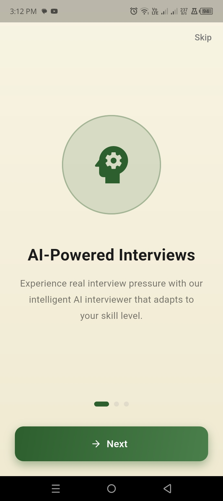	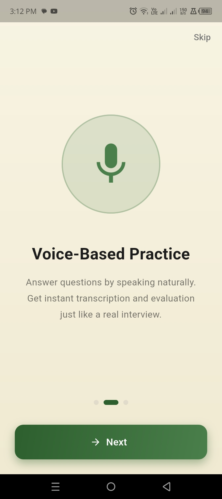	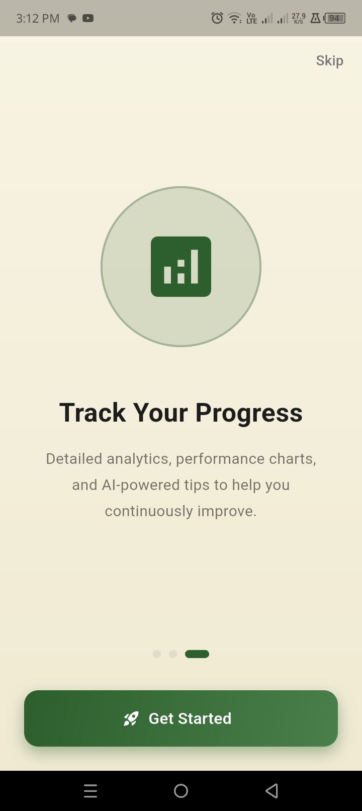
Authentication & Home
Login	Home	
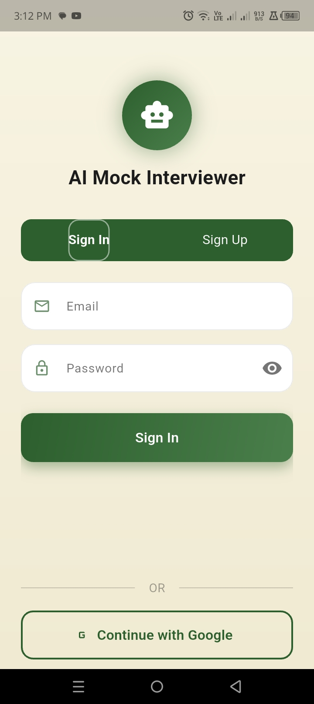	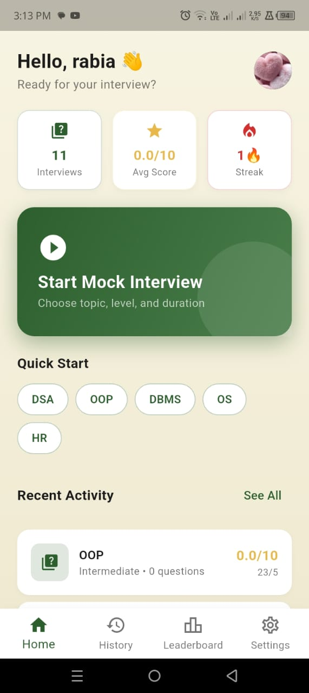	
Interview Setup
Select Topic	Select Difficulty
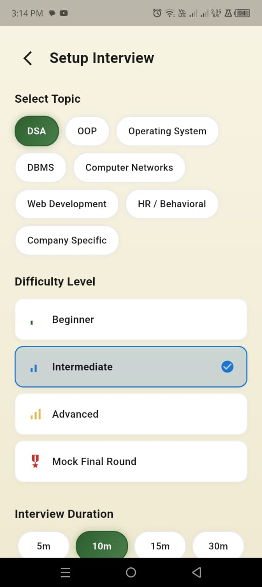	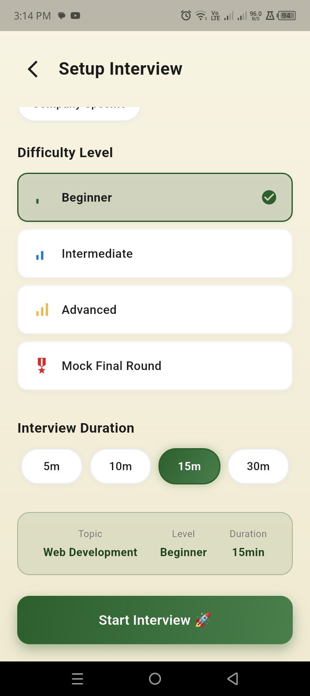
Interview in Progress
Listening Mode	Camera Mode
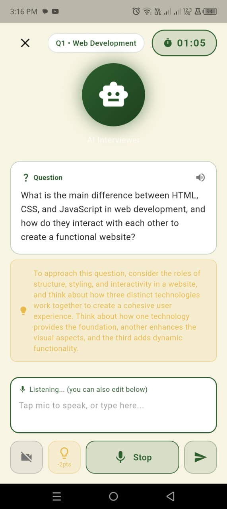	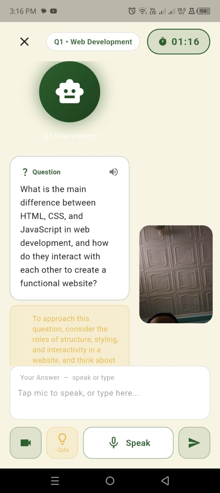
Results & Feedback
Interview Complete	Question Breakdown
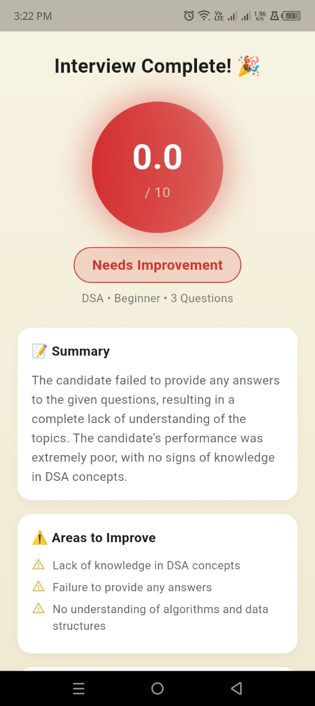	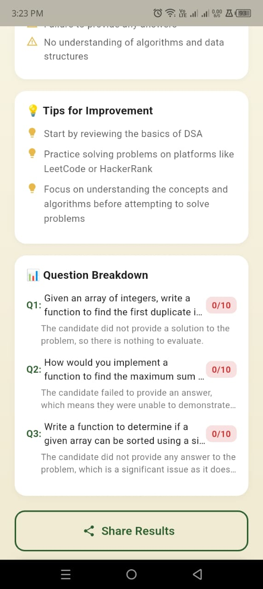
History, Leaderboard & Settings
History	Leaderboard	Settings
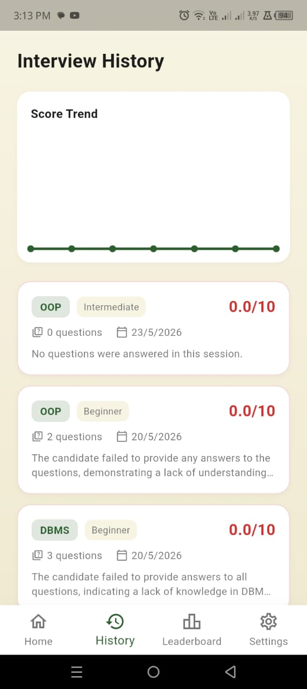	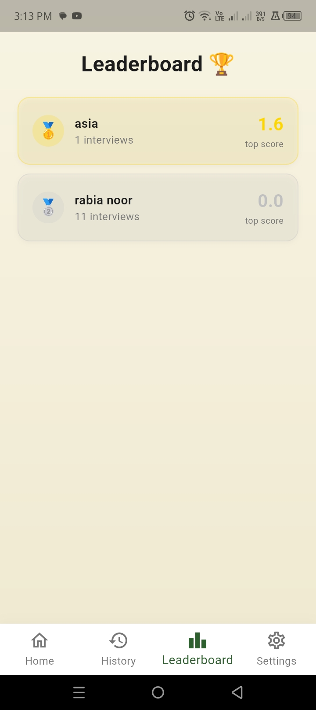	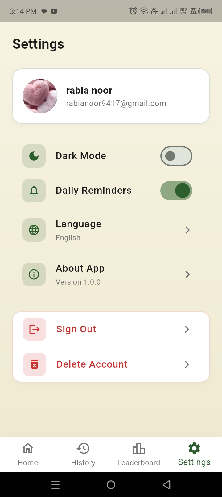
---
🛠️ Tech Stack
Layer	Technology
Framework	Flutter 3.x (Dart ≥3.0)
AI Engine	Groq API — LLaMA 3.3 70B Versatile
Backend	Firebase (Auth, Firestore)
Authentication	Google Sign-In
State Management	Provider 6.x
Speech Input	`speech_to_text` ^7.3.0
Voice Output	`flutter_tts` ^4.2.2
Charts	`fl_chart` ^0.66.2
Animations	`animate_do`, `shimmer`, `smooth_page_indicator`
Notifications	`flutter_local_notifications`
Camera	`camera` ^0.11.1
Env Config	`flutter_dotenv`
---
🚀 Getting Started
Prerequisites
Make sure you have the following installed:
Flutter SDK ≥ 3.0.0
Dart SDK ≥ 3.0.0
Android Studio or VS Code with Flutter plugin
Firebase CLI
A Groq API Key (free tier available)
A Firebase project with Auth and Firestore enabled
---
📦 Installation
1. Clone the repository
```bash
git clone https://github.com/yourusername/ai_mock_interviewer.git
cd ai_mock_interviewer
```
2. Create your `.env` file
> ⚠️ **NEVER commit your `.env` file. It is already listed in `.gitignore`.**
```bash
# Create .env in the project root
touch .env
```
Add the following to `.env`:
```env
GROQ_API_KEY=gsk_your_groq_api_key_here
```
Get your free API key at console.groq.com.
3. Set up Firebase
```bash
# Install FlutterFire CLI
dart pub global activate flutterfire_cli

# Login to Firebase
firebase login

# Configure Firebase for your project
flutterfire configure
```
This generates `lib/firebase_options.dart` automatically.
Enable the following in your Firebase Console:
Authentication → Google Sign-In provider ✅
Cloud Firestore → Create database (start in test mode) ✅
4. Install Flutter dependencies
```bash
flutter pub get
```
5. Run the app
```bash
flutter run
```
For a release build:
```bash
flutter build apk --release
```
---
🔐 Environment Variables
Variable	Description	Required
`GROQ_API_KEY`	Your Groq API key from console.groq.com	✅ Yes
---
🏗️ Architecture
```
lib/
├── main.dart                    # App entry point, provider setup
├── firebase_options.dart        # Auto-generated Firebase config
│
├── constants/
│   ├── app_constants.dart       # API URLs, topics, levels, Firestore keys
│   └── app_colors.dart          # Color palette & theme tokens
│
├── models/
│   ├── user_model.dart          # User data model
│   ├── interview_model.dart     # Interview session model
│   └── question_model.dart      # Question + feedback model
│
├── services/
│   ├── auth_service.dart        # Firebase Auth + Google Sign-In
│   ├── firestore_service.dart   # Firestore CRUD operations
│   ├── groq_service.dart        # Groq LLaMA API integration
│   ├── stt_service.dart         # Speech-to-Text service
│   ├── tts_service.dart         # Text-to-Speech service
│   └── notification_service.dart # Local push notifications
│
├── providers/
│   ├── auth_provider.dart       # Auth state management
│   ├── interview_provider.dart  # Interview session state
│   └── theme_provider.dart      # Light/Dark theme persistence
│
├── screens/
│   ├── splash_screen.dart
│   ├── onboarding_screen.dart
│   ├── login_screen.dart
│   ├── home_screen.dart
│   ├── interview_setup_screen.dart
│   ├── interview_room_screen.dart
│   ├── results_screen.dart
│   ├── history_screen.dart
│   ├── leaderboard_screen.dart
│   ├── profile_setup_screen.dart
│   └── settings_screen.dart
│
└── widgets/
    ├── custom_button.dart
    ├── countdown_timer_widget.dart
    └── performance_chart_widget.dart
```
---
🎮 How It Works
```
User speaks answer
       ↓
Speech-to-Text converts voice → text
       ↓
Text sent to Groq (LLaMA 3.3 70B) for evaluation
       ↓
AI returns score + detailed feedback
       ↓
TTS reads feedback aloud
       ↓
Score saved to Firestore → Leaderboard updated
```
---
🔥 Firebase Firestore Structure
```
users/
  {uid}/
    name, email, photoUrl, targetRole, skills[]

interviews/
  {interviewId}/
    userId, topic, level, score, duration
    questions[]/
      questionText, userAnswer, aiScore, aiFeedback

leaderboard/
  {uid}/
    displayName, totalScore, interviewCount, rank
```
---
🤝 Contributing
Contributions are welcome! Here's how:
Fork the repository
Create a feature branch: `git checkout -b feature/your-feature-name`
Commit your changes: `git commit -m "feat: add your feature"`
Push to the branch: `git push origin feature/your-feature-name`
Open a Pull Request
Please follow Conventional Commits for commit messages.
---
📋 Roadmap
[ ] iOS support
[ ] Offline mode with local LLM
[ ] Resume upload & parsing
[ ] Mock Group Discussion mode
[ ] Company-specific question banks
[ ] Multilingual support (Urdu, Hindi, etc.)
[ ] Web version via Flutter Web
---
⚠️ Important Security Notes
Never commit your `.env` file or any file containing your `GROQ_API_KEY`
Never commit `google-services.json` if it contains sensitive project data
Rotate your Groq API key immediately if accidentally exposed
The `.gitignore` already excludes `.env` — double-check before every push
---
📄 License
This project is licensed under the MIT License — see the LICENSE file for details.
---
👤 Author
Your Name
GitHub: @zahra01-m
LinkedIn: Your LinkedIn
Email: zahramushtaq028@email.com
---
🙏 Acknowledgements
Groq for blazing-fast LLaMA inference
Firebase for backend infrastructure
Flutter team for the amazing framework
pub.dev package authors
---
<div align="center">
  <sub>Built with ❤️ using Flutter & AI</sub>
</div>
